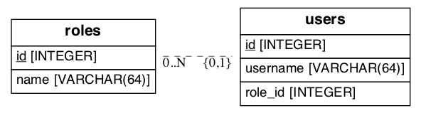

# Chapter 05: Databases

[hello.py](hello.py) 에 sqlalchemy API를 사용해 테이블을 만들고 업데이트 합니다. [Chapter 04](../Chapter04) 와 거의 같은 코드이지만 데이터베이스에서 유저 정보를 읽습니다. 방문했던 유저를 데이터베이스 테이블에서  체크하고 환영의 메세지를 보여줍니다.

## Flask 실행

다음 패키지들을 설치하세요.

```bash
(flasky) Macbook2017:flasky sangmin$ pip install flask-migrate
(flasky) Macbook2017:flasky sangmin$ pip install flask-sqlalchemy
(flasky) Macbook2017:flasky sangmin$ conda install pygraphviz
(flasky) Macbook2017:flasky sangmin$ pip install eralchemy
```

[hello.py](hello.py) 를 실행시킵니다. (실 전에 데이터베이스 파일을 만드셔야하는데요. 아래를 참고하세요.)

```bash
(flasky) Macbook2017:Chapter02 sangmin$ export FLASK_APP=hello.py
(flasky) Macbook2017:Chapter02 sangmin$ export FLASK_DEBUG=1
(flasky) Macbook2017:Chapter02 sangmin$ flask run
```
 
## Data Model



roles, users 두개의 테이블을 사용합니다. [model.py](model.py) 를 이용해 ER diagram을 만들었습니다.

## Database Operations

flask shell 을 사용해서 database 연산을 할 수 있습니다.

### Database Creation + Insert

```bash
(flasky) Macbook2017:Chapter05 sangmin$ flask shell
Python 3.7.3 (default, Mar 27 2019, 16:54:48)
[Clang 4.0.1 (tags/RELEASE_401/final)] on darwin
App: hello [production]
Instance: /Users/sangmin/git/flasky/Chapter05/instance
>>> db
<SQLAlchemy engine=sqlite:////Users/sangmin/git/flasky/Chapter05/data.sqlite>
>>> User

<class 'hello.User'>
>>> db.create_all()
>>> admin_role = Role(name='Admin')
>>> mod_role = Role(name='Moderator')
>>> user_role = Role(name='User')
>>> user_john = User(username='john', role=admin_role)
>>> user_susan = User(username='susan', role=user_role)
>>> user_david = User(username='david', role=user_role)
>>> db.session.add(admin_role)
>>> db.session.add(mod_role)
>>> db.session.add(user_role)
>>> db.session.add(user_john)
>>> db.session.add(user_susan)
>>> db.session.add(user_david)
>>> db.session.commit()
```

### Query

```bash
>>> Role.query.all()
[<Role Admin>, <Role Moderator>, <Role User>]
>>> User.query.all()
[<User john>, <User susan>, <User david>]
>>> User.query.filter_by(role=user_role).all()
[<User susan>, <User david>]
```

### Migration

`flask_migrate` 패키지를 통해서 migration 이 가능합니다. 나중에 실전에 더 필요할때 알아보겠습니다.