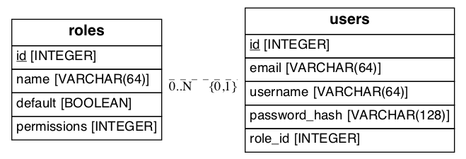

# Chapter 09: User Roles

## 개요

이번 단원은 데이터베이스 테이블 업데이트만 있습니다. 구조상 크게 바뀌는 것이 없습니다.

## Data Model



`roles` 테이블에 `Permission` enum 을 넣어줍니다.

## DB Migration

8장에서 `data-dev.sqlite` 파일을 카피한 뒤에 비슷하게 마이그레이션 해주면됩니다.

```bash
>>> db.session.execute('delete from alembic_version')
>>> db.session.commit()
```

```bash
(flasky) Macbook2017:Chapter09 sangmin$ flask db init
(flasky) Macbook2017:Chapter09 sangmin$ flask db migrate -m "initial migration"
(flasky) Macbook2017:Chapter09 sangmin$ flask db upgrade
```

```bash
>>> Role.insert_roles()
>>> Role.query.all()
[<Role 'Admin'>, <Role 'Moderator'>, <Role 'User'>, <Role 'Administrator'>]
>>> admin_role = Role.query.filter_by(name='Administrator').first()
>>> default_role = Role.query.filter_by(default=True).first()
>>> for u in User.query.all():
...     if u.role is None:
...         u.role = admin_role
...     else:
...         u.role = default_role
... 
>>> db.session.commit()
```
