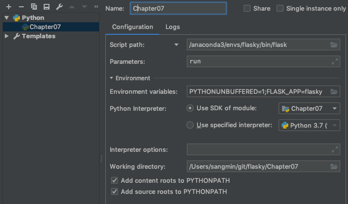

# Flasky

[Flask Web Development](https://github.com/miguelgrinberg/flasky) 책을 읽고 연습한 저장소입니다.

## 설치

conda 를 사용합니다.

```bash
conda env create --name flasky --file environment.yml
```

### 인텔리제이/파이참 사용

[Stackoverflow의 설명](https://stackoverflow.com/questions/8774024/intellij-working-on-multiple-projects) 처럼 셋업을 합니다.

1. Empty project 만들기
2. Module 추가 (나중에는 Project Structure > Module > + 버튼)
3. Import Module
4. Create Module from Existing Source
5. Chapter0x 모듈 추가
6. Dependency 탭에서 Conda environment 설정

설정후에 플라스크 앱을 돌리고 싶다면 아래처럼 하세요. [이글을 참고](https://github.com/pallets/flask/blob/master/docs/cli.rst) 했습니다.



## 목록

- [Chapter 2](Chapter02): Basic Application Structure
- [Chapter 3](Chapter03): Templates
- [Chapter 4](Chapter04): Web Forms
- [Chapter 5](Chapter05): Databases
- [Chapter 7](Chapter07): Large Application Structure

## TODO

- Chapter 8: User Authentication
- Chapter 9~13: User Roles, User Profiles, Blog Posts, Followers, User Comments
- Chapter 14: Application Programming Interfaces
- Chapter 15: Testing
- Chapter 16: Performance
- Chapter 17: Deployment
